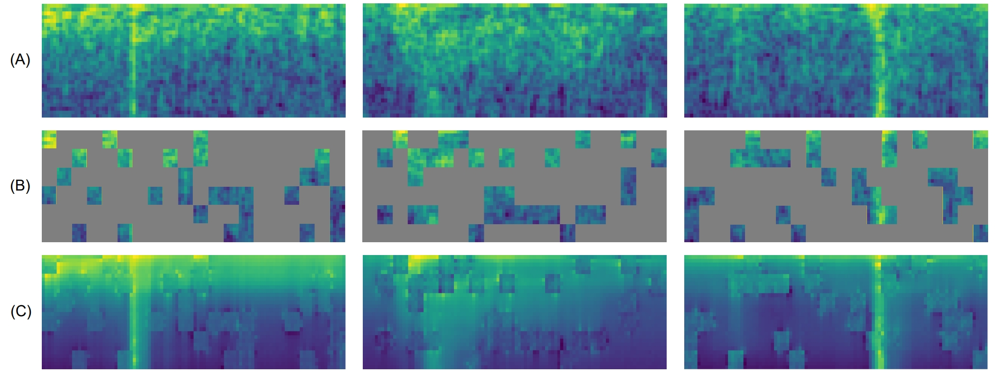
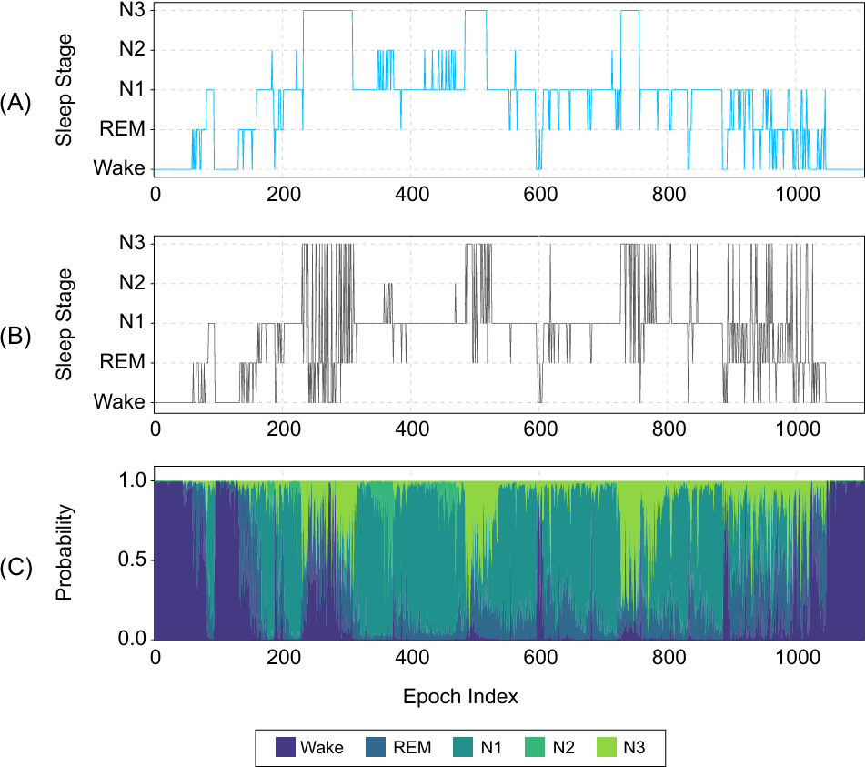

# Superlet-MAE: Self-Supervised Masked Autoencoding for Sleep Staging Using Single-Channel EEG


## 🚀 Abstract
Sleep stage classification is essential for diagnosing sleep disorders, but traditional polysomnography (PSG) is time-consuming and labor-intensive and subject to inter-rater variability, limiting its reliability.
We propose a **_self-supervised learning (SSL) framework_** that integrates the **_Superlet Transform (SLT)_**, offering high-resolution time-frequency analysis, with a **_Masked Autoencoder (MAE)_** architecture.
Single-channel EEG signals (i.e., Fpz-Cz) from the Sleep-EDF dataset were transformed into Superlet scalograms and used for masked reconstruction pretraining.
Our method is the **_first to combine Superlet with MAE_** for EEG representation learning, enabling robust feature extraction from unlabeled data.
Experimental results show that the proposed approach outperforms conventional transforms such as **_Short-Time Fourier Transform (STFT)_** and **_Continuous Wavelet Transform (CWT)_**, achieving state-of-the-art performance in sleep staging.
These findings highlight the potential of Superlet-based SSL for scalable and accurate sleep analysis.


## 📊 Key Results

### 🔹 Comparison of Time-Frequency Representation Methods
| Transform Type |      Accuracy      |   Macro F1 Score   |   Cohen’s Kappa   |
|:--------------:|:------------------:|:------------------:|:-----------------:|
| **_Superlet_** | **_75.87 ± 1.39_** | **_63.23 ± 1.74_** | **_0.64 ± 0.02_** |
|      STFT      |    74.81 ± 1.27    |    61.74 ± 1.76    |    0.62 ± 0.02    |
|      CWT       |    75.45 ± 1.42    |    62.84 ± 1.16    |    0.63 ± 0.02    |

Superlet achieved the **_highest average scores across all metrics_**, with relatively smaller standard deviations, suggesting more consistent and robust classification performance.

---

### 🔹 Comparison with Other Self-supervised Methods
| Model      |      Accuracy      |   Macro F1 Score   |   Cohen’s Kappa   |
|:----------:|:------------------:|:------------------:|:-----------------:|
| **_Ours_** | **_75.87 ± 1.39_** | **_63.23 ± 1.74_** | **_0.64 ± 0.02_** |
| MAEEG      |    72.29 ± 4.56    |    62.58 ± 6.02    |    0.62 ± 0.08    |
| TS-TCC     |    69.27 ± 8.15    |   54.09 ± 18.89    |    0.55 ± 0.15    |
| BENDR      |    70.73 ± 8.57    |    62.04 ± 8.03    |    0.60 ± 0.11    |

Superlet-MAE outperformed all baselines:  
- **+3.58%** higher ACC than **_MAEEG_**
- **+6.6%** higher ACC than **_TS-TCC_** 
- **+5.14%** higher ACC than **_BENDR_**


## 📈 Visualization

### 🔹 MAE Reconstruction
<p align="center">
  
</p>
<p align="center">
  <em>Visualization of MAE reconstruction performance (mask ratio = 0.75).<br>
  (A) original scalogram, (B) masked scalogram, (C) reconstructed scalogram.</em>
</p>

### 🔹 Sleep Stage Hypnogram
<p align="center">
  
</p>
<p align="center">
  <em>Visualization of sleep stage classification for subject #SC4632E0 in Sleep-EDFX.<br>
  (A) ground-truth hypnogram based on manual annotations by sleep experts,<br>
  (B) predicted hypnogram generated by the proposed MAE classifier,<br>
  (C) softmax probability distribution across sleep stage over time.</em>
</p>

## 📂 Repository Structure
```
Superlet-MAE/
│
├── data/
│   ├── __init__.py
│   ├── data_loader.py          # EEG dataset loader
│   ├── morlet.py               # Morlet wavelet utilities
│   ├── preprocess.py           # Convert raw Sleep-EDFX to .npz
│   ├── superlet_transform.py   # Apply Superlet Transform
│   └── superlets.py            # Superlet implementation
│
├── figures/
│   ├── hypnogram.jpg           # Example hypnogram plot
│   └── reconstruction.jpg      # Example reconstruction plot
│
├── models/
│   ├── __init__.py
│   ├── model.py                # MAE (ViT backbone) implementation
│   └── pos_embed.py            # Positional embedding functions
│
├── training/
│   ├── __init__.py
│   ├── linear_probing.py       # Linear probing evaluation
│   └── train.py                # MAE pretraining script
│
├── requirements.txt            # Dependencies
└── README.md                   # Project documentation
```


## ⚙️ Installation
```
$ git clone https://github.com/chajy1212/Superlet-MAE.git
$ cd Superlet-MAE
$ pip install -r requirements.txt
```


## 🏃 Usage

### 1. Download Sleep EDFX Dataset  
Download the Sleep-EDFX dataset from [PhysioNet](https://www.physionet.org/content/sleep-edfx/1.0.0/).

### 2. Preprocess raw EEG data  
Use the preprocessing script to convert raw EDF files into NPZ format:
```bash
python data/preprocess.py
```

### 3. Apply Superlet Transform
Transform the preprocessed EEG data into time–frequency representations:
```bash
python data/superlet_transform.py
```

### 4. Pretrain the MAE Model
Run self-supervised pretraining of the Masked Autoencoder.  
Trained models are saved under `./models/`.
```bash
python training/train.py
```

### 5. Evaluate using Linear Probing
Train a shallow classifier on the encoder’s latent features:
```bash
python training/linear_probing.py
```


## 📌 Acknowledgements

This work was supported by BK21 Four Institute of Precision Public Health.
